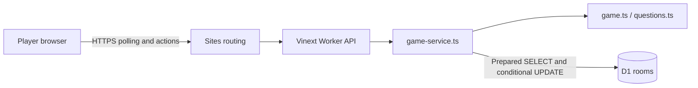
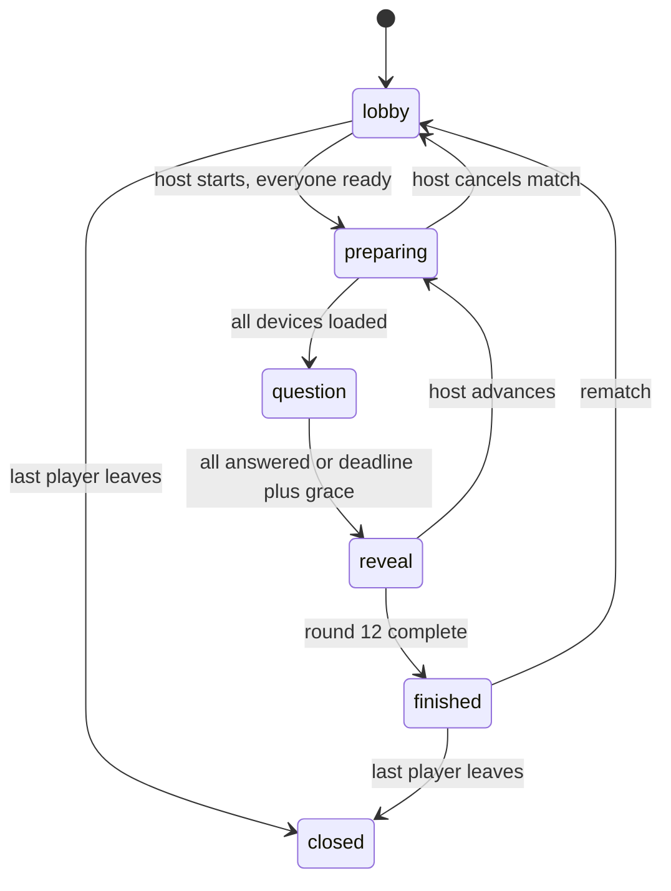

# Technical architecture

## Stack

| Layer | Technology |
| --- | --- |
| UI | React 19.2.6, TypeScript 5.9.3 |
| Framework | Vinext 1.0.0-beta.5 / Next-compatible App Router, Vite 8.0.13 |
| Styling | Tailwind 4.2.1 import, custom responsive CSS, lucide-react icons |
| Runtime | Cloudflare Workers, ESM fetch handler |
| Hosting | OpenAI Sites; currently public |
| Persistence | Cloudflare D1 (SQLite), binding `DB` |
| Schema tooling | Drizzle ORM 0.45.2, drizzle-kit 0.31.10 |
| Database access | D1 prepared statements (not runtime Drizzle queries) |
| Local runtime | Wrangler 4.92.0 / Miniflare |
| Dependencies | npm; `package-lock.json` is the exact version authority |

No music, Bible, or AI API is needed at runtime. The curated question bank is bundled server-side. Several unused starter UI dependencies remain declared.

## Components

- `app/page.tsx`: game screens, session recovery, polling, pending answers.
- `app/api/game/route.ts`: dynamic GET/POST entry points.
- `lib/game-service.ts`: HTTP validation, arrival timestamps, database concurrency, diagnostics.
- `lib/game.ts`: pure rules, state transitions, scoring, redacted views.
- `lib/client-timing.ts`: revision ordering, clock samples, polling intervals.
- `lib/questions.ts`: server-only questions; never import into a client component.
- `db/schema.ts`, `drizzle/`: schema and immutable migration history.
- `build/`: Sites and Worker integration; preserve the Sites build plugin.

## Rules and state machine

2–8 players; twelve rounds; two questions from each of six categories; four choices; one answer each. Correct answers score `100 + round(50 * max(0, 1 - elapsed / 15000))`; incorrect/missing answers score zero. Tied leaders share the win.

Preparation sends the current prompt/options and waits for each device's `loaded` acknowledgement. The last acknowledgement schedules a six-second countdown. The question phase includes countdown plus fifteen answering seconds. The UI hides the prompt until start; solutions, references, explanations, and future questions are withheld until appropriate.

Answer timing uses arrival at the server handler, captured **before** parsing, DB reads, and compare-and-swap retries. Client timestamps cannot backdate answers. At deadline, an eight-second collection grace allows already-received requests to finish. It does not extend answering time. All-answered rounds reveal immediately. Otherwise the next request after deadline plus grace performs settlement; there is no background timer.

## Concurrency and synchronization

Room mutations read `state` and `revision`, then conditionally write `WHERE code = ? AND revision = ?`. Losing requests reread and retry up to twelve times. Revision increases on each successful mutation. Browser snapshots compare revision first, then timestamp; a delayed stale GET cannot roll back an acknowledged answer.

Same-choice retries for the current match/round are idempotent, even after reveal. A different second choice is rejected. Explicit desired readiness is idempotent. Start/next/rematch are not automatically retried.

Clock samples use client send/receive and server receive/send times to exclude server processing from estimated network delay. The browser favors lower-network-delay samples. This assumes approximately symmetric travel and is not perfect synchronization.

Polling is HTTP, **not WebSockets**: lobby/reveal 2 s, active/preparing 1 s, answered 1.5 s, finished 5 s, measured after response completion. Failures back off to 5 s. Foreground actions abort/defer background polling. Requests time out at 12 s. Transient answer failures get one same-choice retry.

Answer selection is shown immediately as pending; saved confirmation requires a server response or snapshot. A failed status poll does not disable answer submission.

## Boundaries

`sessionStorage` holds the room and bearer token; `localStorage` holds only the last name. D1 owns all actual game state. Refresh the same tab to recover. Duplicating a tab can copy its identity; open a fresh tab to simulate another player.

The host can cancel stalled preparation, resetting scores/readiness. Host departure from lobby/results transfers ownership. Automatic mid-match host failover, spectators, accounts, historical results, and cross-device identity recovery are not implemented.

This is a casual party game: preloaded prompts can be inspected by technical users. Very slow/asymmetric networks still affect timing; requests processed beyond the grace can lose to an already finalized round. See [performance notes](performance.md).
